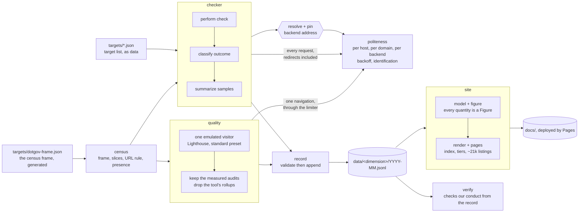
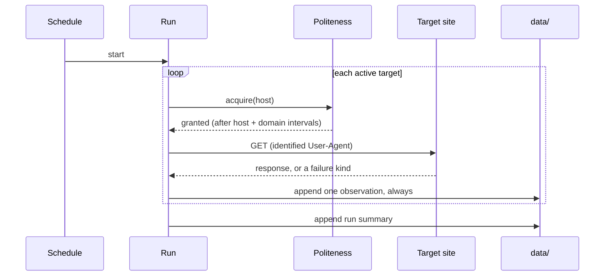

# Architecture

govWebChecker measures public government websites and stores what it finds. This
describes the components as they exist today.

**Status**: User Story 1 is built — the checker measures availability and
response time, records it, and can prove its own conduct from the record. What
is *not* built: the other three dimensions (transport security, the standard
quality audit, technology fingerprinting) and the public site. The target list
is a development seed, not the traffic-selected list the spec requires. See
[`specs/001-record-availability/tasks.md`](specs/001-record-availability/tasks.md).

## Shape of the system

## Components

### `src/politeness/` — the traffic rules

The constraint that separates this project from a stress tester, placed where a
caller cannot route around it.

- `domain.ts` — collapses a hostname to the key that groups hosts likely sharing
  a backend. Takes the last two labels, which is correct for `.gov` and wrong for
  multi-label suffixes; documented at the definition, and the single place that
  changes when scope widens beyond federal.
- `rate-limiter.ts` — three independent limits, whichever is strictest: per host,
  per registrable domain, and per **backend address**. The third exists because
  the first two key on the *name* used to reach a site, and distinct registrable
  domains routinely share one machine — 531 unrelated `.gov` domains answer on a
  single address, and a burst across them satisfies both name-keyed limits
  because every name in it differs. Keys are namespaced, since a host that is its
  own registrable domain would otherwise collide with itself and take the weaker
  of the two intervals. Serializes acquisition, so there is never more than one
  request in flight to a host. Enforced spacing exceeds the configured minimum by
  a small margin so the guarantee holds on the *recorded* timestamps, which is
  what an outside reader can check.
- `backoff.ts` — the wait after a failure, which only ever grows.
- `user-agent.ts` — identification that a caller cannot override.

### `src/census/` — what to check, and when

Deliberately separate from `checker/`. The census decides *what* to check and
*when*; the checker decides *how*. That boundary means the census can change its
frame, its tiers and its cadence without touching the code that talks to a
government server — which is the code the constitution constrains most tightly.

- `frame.ts` — builds the census frame from the published `.gov` registry and
  applies removal requests. Refuses to write a frame that is empty or more than
  20% smaller than the one it replaces: a truncated download would otherwise
  publish as a coverage collapse across US government rather than as our own
  failed HTTP request.
- `slice.ts` — which seventh of the frame a domain belongs to. A pure function of
  the domain name, so a domain's slice never moves when the registry gains or
  loses entries. Keying on registry *position* instead would shift six sevenths
  of the frame on a single insertion, producing double-coverage and gaps that the
  coverage count would not reveal.
- `url.ts` — the rule that turns a bare domain into the URL requested, versioned
  and recorded. HTTPS, both forms considered, the non-resolving one never
  requested.
- `presence.ts` — whether a public website appears to exist. The one judgement in
  the record, fenced into its own field and required to be a pure function of a
  stored observation, so a better rule can be applied to everything already
  collected without re-checking a target.
- `run.ts` — one slice, reusing the checker's limiter and sampling.

### `src/record/` — the stored measurements

The artifact meant to outlive the code, so its rules are enforced rather than
assumed.

- `types.ts` — the observation shape.
- `validate.ts` — checks a record against
  [`contracts/observation.md`](specs/001-record-availability/contracts/observation.md).
  It rejects more than malformed data: verdict fields, stored page content, and
  latency of zero standing in for no measurement are all refused, because those
  are the ways a record stops being honest.
- `writer.ts` — append, and only append. No update, no delete, no deduplication,
  since a correction is a new observation rather than an edit.

### `src/checker/` — performing the measurement

- `resolve.ts` — establishes which backend a host answers on, and pins the
  connection to it. The pin is what makes the address limit real rather than
  decorative: without it the limiter would account for one address while Node
  resolved again and reached another, leaving the record asserting a guarantee
  about a machine never contacted. Where a host publishes several addresses the
  choice is a hash of the host — stable so observations stay comparable, spread
  so a vendor's several machines do not all receive the same customer.
- `check.ts` — one request with socket-level timing, following redirects and
  recording the chain. Every hop passes through the limiter, including the one a
  redirect names: a municipal domain redirecting onto its vendor's host is a
  common shape, so that hop is the one most likely to reach a shared backend. Classifies failures by the lifecycle phase they arrive in
  rather than by error text, which drifts between Node versions. It never returns
  a body. `fetchTextForEvaluation` is the deliberate, size-capped exception, used
  only for `robots.txt` — a file whose purpose is to be read before we act.
- `robots.ts` — a small parser for the directives that decide whether we may
  fetch: User-agent grouping, Disallow, Allow. A group naming us beats the
  wildcard, and the longest matching rule wins, so a site can carve an exception
  out of a broad prohibition and we honor it.
- `sample.ts` — repeated readings through the limiter, summarized as a median
  with min and max. No successful timing means no latency figure at all.
- `run.ts` — one pass. Different hosts run concurrently up to a bound; one host
  never runs concurrently with itself. Politeness is a property of what we do to
  a single server, not of total throughput.

### `src/quality/` — how the page behaved once it answered

- `deep-check.ts` — one emulated visitor loading one page, once. The availability
  check asks whether the server answered; this asks what happened afterwards, and
  that is where the questions people actually have live: how long until something
  was readable, whether the layout moved under them, how much the page weighed on
  a phone. Lighthouse at its own default preset does the measuring, so a stored
  number means the same thing as one a reader runs themselves — comparability is
  the reason for the tool choice, and custom tuning would trade it away.

  Two constraints shape the module. The emulation *is* the method: a duration is
  a property of a page loaded on a stated screen over a stated connection, never
  of a site, so the device and network travel with the number and a run that
  cannot state them yields no reading at all. And the tool's category scores stop
  at the boundary — they are a weighted composite of the very values stored here,
  so they belong to the analysis layer, where the weighting can be published and
  recomputed, rather than to the record, which holds only what was observed.

  There is no retry. A page that failed to render is a page under strain or a page
  that is broken; either way the answer is to write down what happened and leave.
  A tool failure is recorded as a failure of the *check*, never merged into the
  availability outcome — a browser crash says nothing about whether a government
  website was up.

### `src/site/` — the published reading of the record

Reads the record and writes the static site. Sends nothing to any target: the
build has no network path at all, which is stronger than a rule.

- `figure.ts` — the choke point. There is no numeric type in the view model
  other than `Figure`, which cannot be constructed without its tier, population,
  window, sample count and vantage — so a published number without its method is
  unrepresentable rather than discouraged (Principle V). Absence is its own
  type, never a zero. The renderer accepts `Figure`, never `number`.
- `model.ts` — the record shaped for display, one view per tier and deliberately
  no total across them. Refuses to build from a row whose vantage is `local`.
- `standings.ts` — per-dimension orderings. A host that never once answered has
  no rate — it is refusing automation or telling us not to check — and appears
  in no ordering, never as a zero. No composite exists and no field could hold
  one.
- `series.ts` — change over time at each tier's own cadence. The census series
  is discrete *by type*: marks, no points, no path — a line between two weekly
  readings would assert knowledge of the six days between them. Completeness
  comes from run summaries against one frame digest, not from row counts.
- `listing.ts` — one page per site, keyed on host rather than `target_id`
  (the record carries 61 ids over 58 hot hosts from an id-scheme change; keying
  on the id would split three hosts' histories). The undetermined page leads
  with what is unknown and never puts a jurisdiction's name beside a failure
  state.
- `pages.ts` — the streaming writer: index, tier panels, one listing per site
  the record knows, a not-yet-checked page per unreached frame domain, one page
  per registered domain. ~21,300 pages in under four seconds from today's
  record.

The output is tested the way `verify` tests the record: assertions read the
rendered HTML, so a guarantee cannot be bypassed by a template literal the
model-level checks never see.

### `src/cli/` — the command surface

`check` runs a hot-tier pass. `census` runs one broad-tier slice. `build-frame`
rebuilds the census frame. `build-site` reads the record and writes the whole
site — and fails rather than publish a figure it cannot attach a method to. `verify` reads a record and reports whether the
guarantees hold, printing expected versus actual — including backend spacing,
which it can only check because each observation records the address contacted,
and census coverage, which it computes from the record and the committed frame
rather than from our own run summaries.

`verify` matters more than it looks: it reads the *record*, never the code, so
someone who has never seen this repository can run the same check against the
published data and reach the same verdict.

The CLI has no flag that weakens a limit — no `--concurrency`, no
`--rate-limit`, no `--timeout`, not even for local runs, since a local run
reaches the same government servers a scheduled one does. Tests inject limits at
the layer below, so the fast path exists where it cannot ship.

## Data flow

The loop appends an observation whether the target responded or not. A failure is
data, so there is no path through this diagram that produces silence.

Distinct hosts run through this loop concurrently, up to a bound, which means
observations are appended in completion order rather than target order. The
record is therefore not globally chronological, and anything reading it — the
`verify` command included — has to treat per-target ordering as the invariant
rather than per-file.

## Boundaries that matter

- **Nothing writes to `data/` except `record/`**, and it validates first.
- **Nothing makes a request except through `politeness/`.** A future dimension
  that needs to bypass it is a design problem, not a special case. This covers
  every request a check makes, not just the first: redirect hops and the
  `robots.txt` fetch spend the same budget.
- **A limit is accounted for against the machine actually contacted.** Resolution
  and rate limiting are one step, and the address that was accounted for is the
  address the socket is pinned to.
- **The stored record holds no verdicts.** Whether a site counts as "up" is a
  question for the analysis half, where the threshold can change without
  rewriting history. The one reading the record does carry — whether a website
  appears to exist at all — is fenced into its own versioned field, never into
  `outcome`, and is recomputable from stored facts alone.
- **Absence is not failure.** One registered `.gov` in nine publishes no web
  address. A domain that resolves to nothing receives no request and is recorded
  as absent; a resolution failure that might be ours is recorded as undetermined,
  never as the jurisdiction publishing nothing.
- **No page content is persisted.** Analysis of a page happens in memory during a
  check; only findings survive.

## Testing

`node:test`, with local loopback servers as fixtures. No test contacts an
external host — a suite that needs the internet to pass cannot be trusted to run
in CI, and pointing tests at real government sites would violate the project's
own traffic rules.

The politeness limits have tests that fail when a limit is loosened. They are the
one thing here that cannot regress unnoticed.
