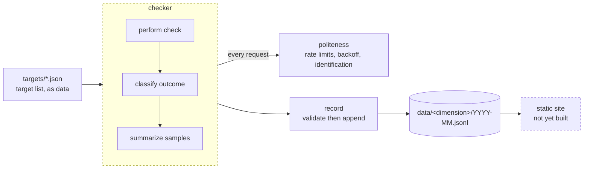
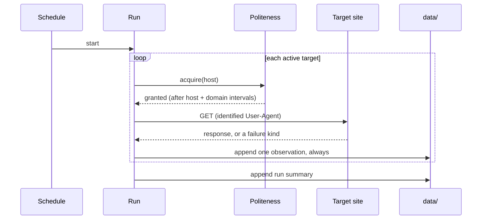

# Architecture

govWebChecker measures public government websites and stores what it finds. This
describes the components as they exist today.

**Status**: the foundational layer is built — the record and the politeness
controls. The checker itself, the CLI, and the schedule are specified and planned
but not yet implemented. See
[`specs/001-record-availability/tasks.md`](specs/001-record-availability/tasks.md)
for what is done and what is not.

## Shape of the system

Dashed components are not implemented yet.

## Components

### `src/politeness/` — the traffic rules

The constraint that separates this project from a stress tester, placed where a
caller cannot route around it.

- `domain.ts` — collapses a hostname to the key that groups hosts likely sharing
  a backend. Takes the last two labels, which is correct for `.gov` and wrong for
  multi-label suffixes; documented at the definition, and the single place that
  changes when scope widens beyond federal.
- `rate-limiter.ts` — two independent limits, per host and per registrable
  domain, whichever is stricter. Serializes acquisition, so there is never more
  than one request in flight to a host. Enforced spacing exceeds the configured
  minimum by a small margin so the guarantee holds on the *recorded* timestamps,
  which is what an outside reader can check.
- `backoff.ts` — the wait after a failure, which only ever grows.
- `user-agent.ts` — identification that a caller cannot override.

### `src/record/` — the stored measurements

The artifact meant to outlive the code, so its rules are enforced rather than
assumed.

- `types.ts` — the observation shape.
- `validate.ts` — checks a record against
  [`contracts/observation.md`](specs/001-record-availability/contracts/observation.md).
  It rejects more than malformed data: verdict fields, stored page content, and
  latency of zero standing in for no measurement are all refused, because those
  are the ways a record stops being honest.
- `writer.ts` — append, and only append. No update, no delete, no deduplication,
  since a correction is a new observation rather than an edit.

### `src/checker/` — not yet built

Performs one check, classifies the outcome from request-lifecycle events, and
summarizes repeated samples into a median with its spread.

### `src/cli/` — not yet built

Two commands: `check` runs a pass; `verify` reads a record and reports whether the
politeness guarantees hold. `verify` exists so the claims are checkable from the
published data by someone who has never read this code.

## Data flow

The loop appends an observation whether the target responded or not. A failure is
data, so there is no path through this diagram that produces silence.

## Boundaries that matter

- **Nothing writes to `data/` except `record/`**, and it validates first.
- **Nothing makes a request except through `politeness/`.** A future dimension
  that needs to bypass it is a design problem, not a special case.
- **The stored record holds no verdicts.** Whether a site counts as "up" is a
  question for the analysis half, where the threshold can change without
  rewriting history.
- **No page content is persisted.** Analysis of a page happens in memory during a
  check; only findings survive.

## Testing

`node:test`, with local loopback servers as fixtures. No test contacts an
external host — a suite that needs the internet to pass cannot be trusted to run
in CI, and pointing tests at real government sites would violate the project's
own traffic rules.

The politeness limits have tests that fail when a limit is loosened. They are the
one thing here that cannot regress unnoticed.
