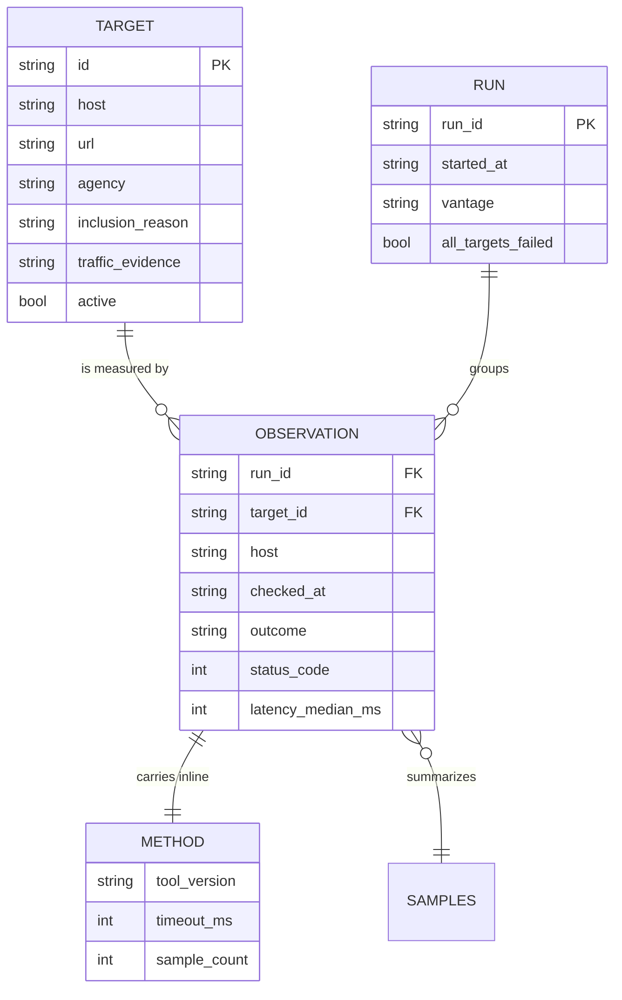

# Phase 1 Data Model: User Story 1

Scoped to what US1 stores. Entities the spec defines but US1 does not yet write
(Property, Agency, Finding) are described only where US1 must avoid closing a door
on them.

## The shape of the record

Two things are deliberately absent from `OBSERVATION`: any property or grouping
key, and any derived judgement such as "up" or "healthy". The first is FR-001c —
regrouping hosts must never touch stored rows. The second is Principle IV — the
record stores what happened, and whether that counts as "up" is a question the
analysis half answers, in `002`, where the threshold can be argued about and
changed without rewriting history.

## Target

Lives in `targets/federal.json`, versioned as data (FR-001).

| Field | Type | Notes |
| --- | --- | --- |
| `id` | string | Stable, never reused. Survives a host rename so history stays joined |
| `host` | string | The hostname checked |
| `url` | string | The exact URL requested — FR-003's unit is the host, but the measurement is of a URL |
| `agency` | string | Accountable organization (FR-001b's other half) |
| `jurisdiction` | string | `federal` today. Present from the start so widening scope adds rows, not columns |
| `inclusion_reason` | string | Why this target is on the list (FR-001) |
| `traffic_evidence` | object | The measurement and source that earned inclusion (FR-001a) |
| `traffic_unit_mismatch` | string? | Set when the traffic source aggregates differently than we measure (FR-001a) |
| `active` | boolean | Retiring sets this false; the target and its history stay (FR-001) |

**Not here**: the property mapping. It lives in a separate file so it can be
revised without touching targets or observations (FR-001b, FR-001c). US1 does not
read it.

## Observation

One line of `data/availability/YYYY-MM.jsonl`. Immutable once written (FR-017).

| Field | Type | Notes |
| --- | --- | --- |
| `schema` | string | Version of this record shape. Present from row one, so US2–US4 can extend without ambiguity |
| `run_id` | string | Groups a run (FR-024) |
| `target_id` | string | Joins to Target |
| `host` | string | Denormalized so a row is readable alone (FR-021) |
| `url` | string | What was actually requested |
| `dimension` | string | `availability` for US1 |
| `checked_at` | string | UTC, when the check *ran* — never when it was scheduled (FR-011) |
| `outcome` | enum | `success`, `http_error`, `timeout`, `connection_failure`, `dns_failure`, `tls_failure`, `blocked`, `skipped` (FR-013) |
| `status_code` | number? | Present only when a response arrived |
| `redirect_chain` | string[] | Empty when none; the final URL is what was measured |
| `latency` | object | See below. Absent when no response arrived |
| `skip_reason` | string? | Why, when `outcome` is `skipped` — e.g. robots.txt (FR-005) |
| `method` | object | See below (FR-014) |

### `latency`

| Field | Notes |
| --- | --- |
| `samples` | How many readings (FR-011a) |
| `median_ms` | The stored figure. Median, not mean — R5 |
| `min_ms`, `max_ms` | The spread SC-009 needs to tell regression from runner noise |

A single reading is never stored as a site's response time (FR-011a). If only one
sample succeeded, `samples` is 1 and the spread is degenerate — visible, rather
than disguised as a clean number.

### `method`

Inline on every row (FR-014). Redundant, and deliberately so: any extracted subset
of the record stays self-describing, which is what Principle V asks for.

| Field | Notes |
| --- | --- |
| `vantage` | Where the check ran from |
| `timeout_ms` | The limit that produced a `timeout` outcome |
| `sample_count` | Requested samples, which may exceed those that succeeded |
| `tool_version` | This project's version |
| `source` | `self_run`. Present from row one because FR-018b requires the record to accommodate other sources without altering stored rows |

## Run

| Field | Notes |
| --- | --- |
| `run_id` | Referenced by every observation in it |
| `started_at`, `finished_at` | UTC |
| `targets_attempted`, `targets_succeeded` | |
| `all_targets_failed` | The FR-024 marker. Set when nothing succeeded, so a fault in our own network is never read later as a nationwide outage |
| `vantage` | Denormalized onto observations too |

## Rules that the data model enforces

- **Append-only.** Writes only ever append a line. A correction is a new
  observation, never an edit (FR-017).
- **A gap is a gap.** A run that did not happen leaves no rows. Nothing backfills
  or interpolates (US1 scenario 5).
- **No verdicts.** No `up`, no `healthy`, no score. Only what was observed.
- **Self-describing rows.** Any single line can be understood without the target
  list, the code, or another file (FR-021).
- **Additive evolution.** New dimensions add fields and new files; they never
  redefine an existing field's meaning. `schema` is how a reader tells which rules
  applied when a row was written.
