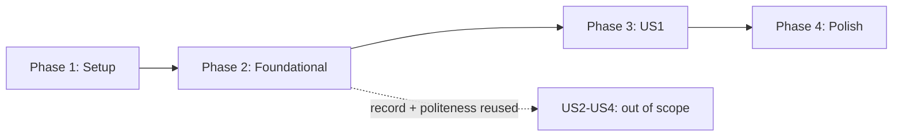

# Tasks: User Story 1 — uptime and speed, sampled continuously

**Input**: Design documents from `specs/001-record-availability/`

**Prerequisites**: [plan.md](./plan.md), [spec.md](./spec.md),
[research.md](./research.md), [data-model.md](./data-model.md),
[contracts/](./contracts/)

**Tests**: Included and non-optional. The project constitution makes test-first
the default and requires that the politeness limits have tests which fail if a
limit is removed or loosened. Every behavior below starts from a failing test.

**Scope**: User Story 1 only. Stories 2–4 are out of scope; tasks here must not
foreclose them (see plan.md § Designed-for extension).

## Format: `[ID] [P?] [Story] Description`

- **[P]**: Can run in parallel (different files, no dependencies)
- **[Story]**: Which user story the task belongs to
- Every task names its file path

## Path Conventions

Single project. `src/` and `tests/` at repository root, per plan.md § Project
Structure.

---

## Phase 1: Setup (Shared Infrastructure)

**Purpose**: Bring the repository from documents-only to a buildable project.

- [x] T001 Create `package.json` with `build`, `test`, and `verify` scripts, zero runtime dependencies, dev-only `typescript` and `@types/node`
- [x] T002 [P] Create `tsconfig.json` targeting current Node LTS, strict mode on
- [x] T003 [P] Create `.gitignore` for `node_modules/`, `dist/`, and local scratch — never for `data/`, which is the product
- [x] T004 [P] Create `.pre-commit-config.yaml` with the official gitleaks hook, and `.gitleaks.toml` for any project-specific rules
- [x] T005 [P] Create `.github/workflows/secret-scan.yml` running gitleaks on push and pull request
- [x] T006 [P] Create `.github/workflows/ci.yml` running build and tests on push and pull request
- [x] T007 Create `ARCHITECTURE.md` at repo root with initial components and a Mermaid structure diagram

**Note on T004–T005**: the constitution requires three independent secret layers.
These are two of them; the third is platform push protection, which is repository
settings and belongs in `infra/` — out of scope here, tracked in Phase 5.

---

## Phase 2: Foundational (Blocking Prerequisites)

**Purpose**: The record and the politeness layer. Every user story writes through
these, so they block all of Phase 3 and must not be story-specific.

### Test fixtures

- [x] T008 [P] Create local fixture servers in `tests/fixtures/servers.ts`: fast responder, slow responder, and one that never responds
- [ ] T009 [P] Create failing fixture servers in `tests/fixtures/failing.ts`: connection refused, invalid TLS certificate, HTTP error statuses, and one that refuses an automated User-Agent
- [ ] T010 [P] Add a test helper in `tests/fixtures/no-network.ts` that fails any test attempting a non-loopback connection, enforcing SC-006

### The observation record

- [x] T011 [US1] Write failing test in `tests/unit/record-shape.test.ts` asserting a record matches `contracts/observation.md` — required fields present, `method` on every row, no verdict fields
- [x] T012 [US1] Implement record types in `src/record/types.ts` per `data-model.md`
- [x] T013 [US1] Write failing test in `tests/unit/writer.test.ts`: appends a line, partitions by month, creates the file when absent, and never rewrites an existing line
- [x] T014 [US1] Implement the append-only writer in `src/record/writer.ts`, partitioning to `data/<dimension>/YYYY-MM.jsonl`
- [x] T015 [US1] Write failing test asserting a second write of the same observation appends rather than replaces, and that an earlier line stays byte-identical (FR-017) — folded into `tests/unit/writer.test.ts` rather than a separate file

### The politeness layer

- [x] T016 [P] Write failing test in `tests/unit/registrable-domain.test.ts` covering the two-label rule for `.gov`, plus a documented expected-failure case for `state.tx.us` marking the known limit from research.md R4
- [x] T017 Implement `registrableDomain()` in `src/politeness/domain.ts`, with the two-label assumption documented at the definition
- [x] T018 Write failing test in `tests/unit/rate-limit-host.test.ts` asserting requests to one host are separated by at least the minimum interval, and that the test fails if the interval is reduced (constitution quality gate)
- [x] T019 Implement the per-host limiter in `src/politeness/rate-limiter.ts`
- [x] T020 Write failing test in `tests/unit/rate-limit-domain.test.ts` asserting hosts sharing a registrable domain are separated by the per-domain minimum (FR-003a)
- [x] T021 Extend `src/politeness/rate-limiter.ts` with the per-domain limiter, independent of the per-host one
- [x] T022 [P] Write failing test in `tests/unit/user-agent.test.ts` asserting every outbound request carries the identifying User-Agent and that no code path can replace it
- [x] T023 Implement the fixed User-Agent in `src/politeness/user-agent.ts`, including the operator-facing URL (FR-002)
- [x] T024 Write failing test in `tests/unit/backoff.test.ts` asserting the wait after a failure is longer than the normal interval and never shorter (FR-006)
- [x] T025 Implement backoff in `src/politeness/backoff.ts`

**Checkpoint**: the record can be written and the traffic rules are enforceable
and tested. Phase 3 can begin.

---

## Phase 3: User Story 1 — uptime and speed (Priority: P1)

**Goal**: A scheduled pass over the federal target list that records, for each
target, whether it responded and how quickly.

**Independent test**: Run against the fixture servers of Phase 2 and confirm the
stored series reflects each server's actual behavior — including the gaps
(spec.md, US1 Independent Test).

### Targets

- [ ] T026 [US1] Write failing test in `tests/unit/targets.test.ts`: loads the list, rejects a target missing `inclusion_reason` or `traffic_evidence`, and ignores inactive targets
- [ ] T027 [US1] Implement target loading and validation in `src/targets/load.ts` per `data-model.md`
- [ ] T028 [US1] Create `targets/federal.json` with a small development seed, each entry carrying its `inclusion_reason` and `traffic_evidence`

**T028 is deliberately a seed, not the real list.** FR-001a requires targets be
selected by measured traffic, and the traffic source is recorded as NOT VERIFIED
in spec.md. Populating the real list is Phase 5 (T047) and is blocked on
confirming that source.

### Checking

- [ ] T029 [US1] Write failing test in `tests/integration/classify.test.ts` asserting each fixture produces its distinct outcome: success, http_error, timeout, connection_failure, dns_failure, tls_failure, blocked (FR-013)
- [ ] T030 [US1] Implement outcome classification in `src/checker/classify.ts` from request-lifecycle events, not error strings (research.md R3)
- [ ] T031 [US1] Write failing test in `tests/integration/check.test.ts` asserting one check records elapsed time, final status, and the redirect chain, with the final URL as what was measured
- [ ] T032 [US1] Implement the single check in `src/checker/check.ts` using `node:https` with socket-level timing
- [ ] T033 [US1] Write failing test in `tests/integration/sampling.test.ts` asserting several samples are taken, spaced by the per-host interval, and that median, min, max, and count are stored (FR-011a, FR-011b)
- [ ] T034 [US1] Implement multi-sample timing and the median in `src/checker/sample.ts`
- [ ] T035 [US1] Write failing test in `tests/integration/sampling-failure.test.ts` asserting a total failure stores `samples: 0` with no latency figure — never zero-as-absence (Principle V)
- [ ] T036 [P] [US1] Write failing test in `tests/integration/robots.test.ts` asserting a disallowed target is skipped and recorded with its reason, with no request beyond `robots.txt` (FR-005)
- [ ] T037 [US1] Implement `robots.txt` fetching and evaluation in `src/checker/robots.ts`

### Runs

- [ ] T038 [US1] Write failing test in `tests/integration/run.test.ts` asserting one observation per active target, that one target's failure does not stop the rest (FR-023), and that a run where everything failed carries the run-level marker (FR-024)
- [ ] T039 [US1] Implement run orchestration in `src/checker/run.ts`, bounding concurrency across hosts and forbidding it within a host
- [ ] T040 [P] [US1] Write failing test in `tests/integration/no-bodies.test.ts` asserting no page body, subresource, or screenshot reaches disk during a run (FR-015)

### Command surface

- [ ] T041 [US1] Write failing test in `tests/integration/cli-check.test.ts` asserting `check` exits 0 when targets are down, exits 1 only when the run cannot proceed, and that `--dry-run` writes nothing while still obeying limits
- [ ] T042 [US1] Implement the `check` command in `src/cli/index.ts` per `contracts/checker-cli.md`, with no flag that weakens a limit
- [ ] T043 [US1] Write failing test in `tests/integration/cli-verify.test.ts` asserting `verify` detects a crafted record violating per-host spacing, per-domain spacing, a future timestamp, and a row missing its method
- [ ] T044 [US1] Implement the `verify` command in `src/cli/verify.ts`, printing expected-versus-actual verdicts and exiting non-zero on violation (SC-002, SC-012)

### Scheduling

- [ ] T045 [US1] Create `.github/workflows/check.yml` running the checker on a daily schedule and committing appended records back, guarded by a concurrency group (research.md R6)

**Checkpoint**: US1 is complete and independently deliverable. The system
measures, records, and can prove its own politeness from the record alone.

---

## Phase 4: Polish & Cross-Cutting Concerns

- [ ] T046 Update `ARCHITECTURE.md` with the delivered components and a Mermaid data-flow diagram, in this same change per the project default
- [ ] T047 Walk `quickstart.md` end to end against the seed targets and correct any step that does not work as written

---

## Phase 5: Blocked or Deferred (not part of US1 delivery)

Recorded so they are not lost, and explicitly *not* required for US1 to ship.

- [ ] T048 Confirm the federal traffic dataset's availability, coverage, and unit of aggregation, then populate the real `targets/federal.json` (blocked: source unverified in spec.md)
- [ ] T049 Add `infra/` Terraform enabling platform secret scanning with push protection — the third secret layer the constitution requires
- [ ] T050 Verify whether scheduled workflows are disabled after repository inactivity, and how that interacts with a repository whose only activity is its own automated commits (research.md R6)
- [ ] T051 Author the host-to-property mapping file and its schema (FR-001b) — not read by US1, needed by `002`

---

## Dependencies

- **Phase 1 → Phase 2**: nothing compiles until the project exists.
- **Phase 2 → Phase 3**: every check writes through the record and the politeness
  layer. Building a check first would mean building it twice.
- **Within Phase 3**: targets (T026–T028) → checking (T029–T037) → runs
  (T038–T040) → commands (T041–T044) → schedule (T045).
- **Phase 5 blocks nothing.** T048 blocks the *real* target list, not the code.

## Parallel opportunities

- **Phase 1**: T002–T006 are all independent files.
- **Phase 2**: the three fixture tasks (T008–T010) are independent of each other
  and of everything else; T016 and T022 touch separate files from the limiter
  work.
- **Phase 3**: T036 (robots) and T040 (no bodies) are independent of the sampling
  chain.

Tests and their implementations are never parallel with each other — the failing
run has to come first, which is the point.

## Implementation strategy

**MVP is Phase 1 → Phase 3.** At T045 the project does the thing its README
claims: it checks federal websites for status and speed and keeps the answer.

Deliver in checkpoint order. Phase 2's checkpoint is worth stopping at — if the
politeness tests do not fail when a limit is loosened, nothing built on top of
them can be trusted, and that is cheaper to find at T025 than at T045.

Per the constitution, show the failing test run before each implementation task
and the passing run after. That evidence is the point of the ordering, not
paperwork about it.
